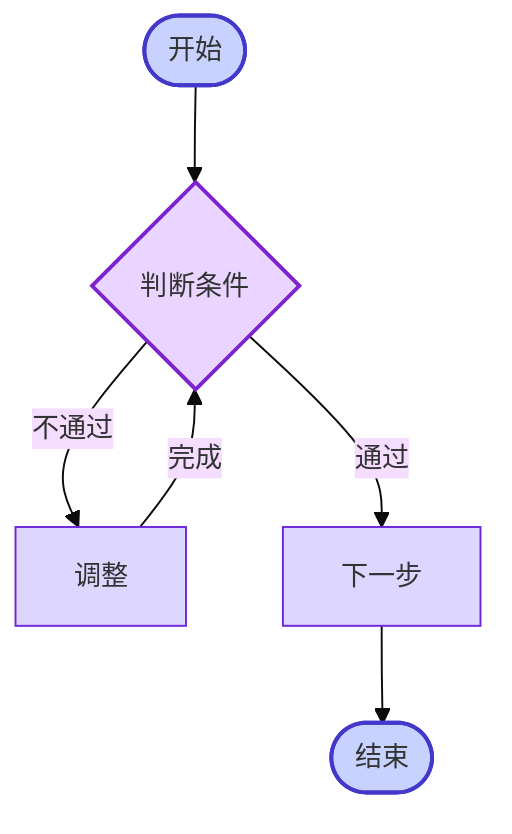
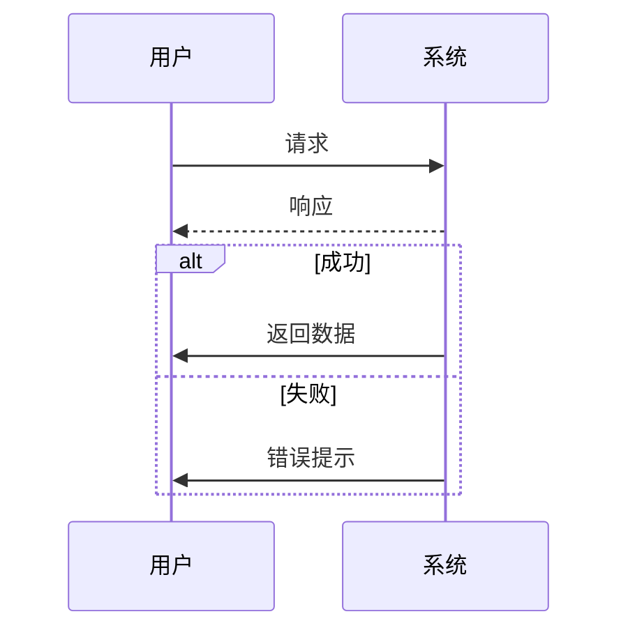
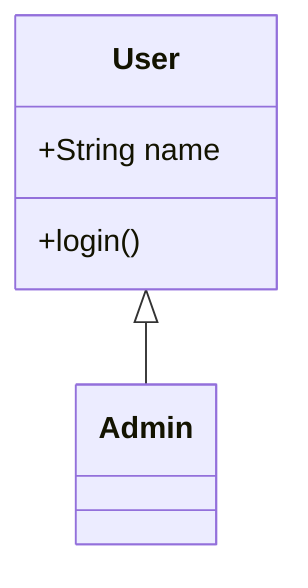
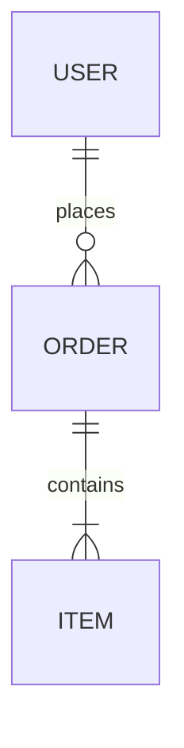

# AI 文档进阶参考

本文件提供 SKILL.md 中提到但需要更多细节的复杂场景参考。智能体在生成时按需查阅本文件即可，无需把所有细节都装入主指令。

---

## 1. 复杂多层架构图示例（Tailwind HTML 等宽方案）

> **使用场景**：≥ 3 层、含子系统嵌套、需层级**严格等宽对齐**的企业级架构图。Mermaid `subgraph` 在此场景下宽度无法对齐，必须改用 HTML。

### 1.1 整体骨架

```html
<div class="border-2 border-cyan-300 rounded-lg overflow-hidden bg-white shadow-sm">
    <!-- 顶部标题（可选） -->
    <div class="bg-cyan-100 text-cyan-900 text-center py-2 font-bold border-b-2 border-cyan-300">
        系统架构总览
    </div>

    <!-- 重复多层（每层一个 .flex 行） -->
    <div class="flex border-b-2 border-{color}-300">
        <!-- 左侧纵向标签栏，固定宽度 -->
        <div class="w-10 bg-{color}-100 flex items-center justify-center border-r-2 border-{color}-300">
            <span class="text-{color}-900 text-sm font-bold"
                  style="writing-mode:vertical-rl;letter-spacing:0.4em;">层级名称</span>
        </div>
        <!-- 右侧内容区，flex-1 占满剩余宽度（关键！保证等宽） -->
        <div class="flex-1 bg-{color}-50 p-3">
            <!-- grid 布局 -->
        </div>
    </div>
</div>
```

### 1.2 每层内部布局选择

| 层类型 | 推荐 grid 列数 | 示例 |
|---|---|---|
| 业务应用层（多子系统） | `grid-cols-12` 切分 5+2+5 | 左子系统 / 中间箭头 / 右子系统 |
| 服务支持层 | `grid-cols-5` × N 行 | 10 个微服务排 2 行 |
| 数据资源层 | `grid-cols-6` | 6 个数据库图标 |
| 基础设施层 | `grid-cols-5` | 服务器/OS/网络/数据库等 |

### 1.3 推荐配色（Tailwind v4）

| 层级语义 | 颜色族 | 示例 class |
|---|---|---|
| 接入/展示层 | `sky` 或 `blue` | `bg-sky-50/100`、`border-sky-300` |
| 业务应用层 | `cyan` 或 `emerald` | `bg-cyan-50/100`、`border-cyan-300` |
| 应用支持层/中间件 | `yellow` 或 `amber` | `bg-yellow-50/100` |
| 数据/信息资源层 | `orange` | `bg-orange-50/100` |
| IT 基础设施层 | `green` | `bg-green-50/100` |

### 1.4 子系统嵌套与跨系统数据流

```html
<div class="grid grid-cols-12 gap-2">
    <!-- 左子系统 -->
    <div class="col-span-5 border-2 border-dashed border-cyan-400 rounded-lg p-2">
        <div class="text-center font-semibold text-cyan-800 mb-2">子系统A</div>
        <!-- 内部模块 -->
    </div>
    <!-- 中间业务流向箭头 -->
    <div class="col-span-2 flex flex-col justify-around items-center">
        <div class="text-xs text-cyan-700">数据流1 →</div>
        <div class="text-xs text-cyan-700">数据流2 ←</div>
    </div>
    <!-- 右子系统 -->
    <div class="col-span-5 border-2 border-dashed border-cyan-400 rounded-lg p-2">
        <div class="text-center font-semibold text-cyan-800 mb-2">子系统B</div>
    </div>
</div>
```

### 1.5 模块卡片样式

```html
<!-- 模块分组容器 -->
<div class="border border-dashed border-cyan-400 rounded p-1.5">
    <div class="text-xs font-medium text-cyan-700 text-center mb-1">分组标题</div>
    <div class="grid grid-cols-2 gap-1.5">
        <div class="bg-white border border-cyan-400 rounded text-center text-xs py-1">模块1</div>
        <div class="bg-white border border-cyan-400 rounded text-center text-xs py-1">模块2</div>
    </div>
</div>
```

---

## 2. Mermaid 图表进阶

### 2.1 流程图（含判断分支与回流）



**节点形状对照**：

| 形状 | 语法 | 用途 |
|---|---|---|
| 矩形 | `[文本]` | 普通处理步骤 |
| 圆角矩形 | `(文本)` | 子流程 |
| 胶囊 | `([文本])` | 开始/结束 |
| 菱形 | `{文本}` | 判断决策 |
| 圆柱 | `[(文本)]` | 数据库/存储 |
| 平行四边形 | `[/文本/]` | 输入/输出 |

### 2.2 时序图



### 2.3 类图与 ER 图





### 2.4 主题与字体调整

在图表第一行加入：

```
%%{init: {'theme':'base','themeVariables':{'fontSize':'14px','primaryColor':'#dbeafe'}}}%%
```

可选 theme：`default` / `neutral` / `dark` / `forest` / `base`。

---

## 3. Prism.js 代码高亮扩展

### 3.1 已默认引入语言

js / ts / python / java / bash / json / sql / yaml

### 3.2 扩展更多语言

在 head 已有 Prism 引用之后追加：

```html
<script src="https://cdn.jsdelivr.net/npm/prismjs@1.29.0/components/prism-{lang}.min.js"></script>
```

常用语言名：`go`、`rust`、`csharp`、`kotlin`、`swift`、`docker`、`nginx`、`graphql`、`markdown`、`xml`、`scss`、`tsx`、`jsx`、`vue`。

### 3.3 代码块完整结构（含复制按钮）

```html
<div class="code-block-wrapper">
    <div class="code-block-header">
        <span class="lang-tag"><span class="lang-dot"></span>python</span>
        <button class="code-copy-btn" onclick="copyCode(this)">复制</button>
    </div>
<pre class="language-python"><code class="language-python">def hello():
    print("Hello")</code></pre>
</div>
```

### 3.4 HTML 转义对照

| 原字符 | 转义 |
|---|---|
| `<` | `&lt;` |
| `>` | `&gt;` |
| `&` | `&amp;` |
| `"` | `&quot;`（属性内）|

**忽略转义** = 浏览器误解析。务必检查包含泛型 `<T>`、比较 `a > b`、引用 `&amp;` 的代码。

---

## 4. 打印 / PDF 导出 CSS

示例中默认已包含。若新增大型组件，需在 `<style media="print">` 中追加：

```css
.your-component {
    page-break-inside: avoid;
    break-inside: avoid;
}
```

强制不分页元素：图表、表格、代码块、卡片。

---

## 5. 配色与组件速查

### 5.1 章节卡片
```html
<section class="mb-12 bg-white rounded-xl shadow-sm p-8">
    <h2 class="text-2xl font-bold text-gray-900 mb-6">标题</h2>
</section>
```

### 5.2 提示框（4 种语义色）

```html
<!-- 信息 -->
<div class="p-4 bg-blue-50 rounded-lg border border-blue-200 text-blue-800">
    <strong>💡 提示：</strong>...
</div>
<!-- 成功 -->
<div class="p-4 bg-green-50 rounded-lg border border-green-200 text-green-800">
    <strong>✅ 完成：</strong>...
</div>
<!-- 警告 -->
<div class="p-4 bg-amber-50 rounded-lg border border-amber-200 text-amber-800">
    <strong>⚠️ 注意：</strong>...
</div>
<!-- 危险 -->
<div class="p-4 bg-red-50 rounded-lg border border-red-200 text-red-800">
    <strong>🚫 警告：</strong>...
</div>
```

### 5.3 表格

```html
<div class="overflow-x-auto">
    <table class="w-full border-collapse">
        <thead>
            <tr class="bg-gray-50">
                <th class="border border-gray-200 px-4 py-3 text-left">列1</th>
            </tr>
        </thead>
        <tbody>
            <tr><td class="border border-gray-200 px-4 py-3">值</td></tr>
        </tbody>
    </table>
</div>
```

### 5.4 折叠 FAQ

```html
<details class="border rounded-lg">
    <summary class="p-4 font-medium cursor-pointer hover:bg-gray-50">问题</summary>
    <div class="p-4 pt-0 border-t"><p class="text-gray-600">答案</p></div>
</details>
```

---

## 6. 文件大小与性能建议

| 内容规模 | 处理建议 |
|---|---|
| < 2000 行 | 单文件即可 |
| 2000–5000 行 | 折叠次要章节用 `<details>`，启用 `content-visibility:auto` |
| > 5000 行 | 拆分为多个 HTML 文件，用导航跳转 |

示例已为 `.content-auto` 提供 `content-visibility: auto` 工具类，可对长章节启用以加速渲染。
